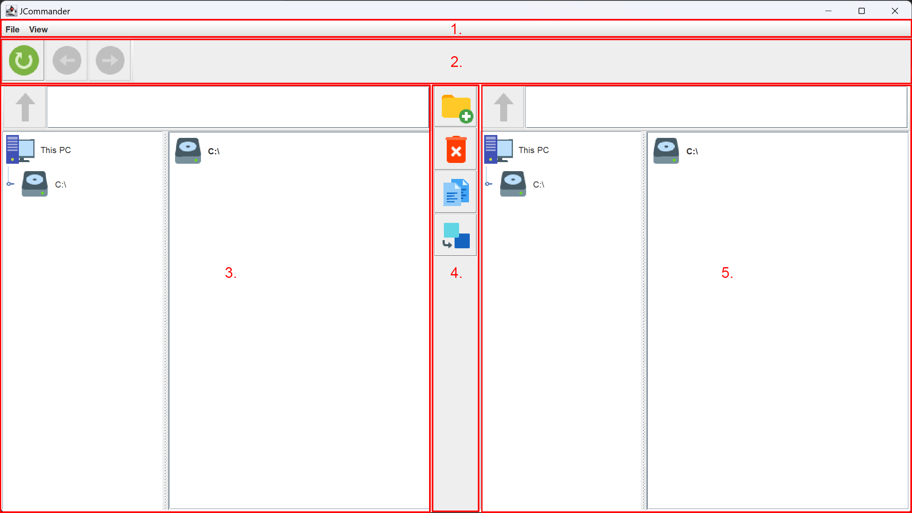

# Két paneles fájlkezelő applikáció

## Alapok, terminológia

A program megnyitása után azonnal megjelenik az alkalmazás főablaka az elsődleges kijelzőn.

A főablak 5 részre osztható:

1. menüszalag
2. navigációs sáv
3. bal oldali munkapanel
4. eszközsáv
5. jobb oldali munkapanel

Futás közben minden időpillanatban pontosan egy munkapanel aktív, és pontosan egy passzív.
Kezdetben a bal oldali munkapanel az aktív, és a jobb oldali a passzív.

## Szolgáltatások

A program az alább ismertetett funkciókat valósítja meg.

* Böngészés a fájlrendszerben
* Navigáció a munkamappában
* Szülő mappa
* Elérési útra ugrás
* Elemek kijelölése
* Mappa létrehozása
* Törlés
* Másolás
* Áthelyezés

### Böngészés a fájlrendszerben

Egy-egy munkapanelen a másiktól függetlenül lehet böngészni a fájlrendszer struktúrájában.
Erre két nézeten keresztül is nyújt lehetőséget a program:

* fa-nézet
* mappa-nézet

Alapértelmezetten mindkét nézet megjelenik egymás mellett a panelen.
Bármelyikkel történő interakció során frissül a másik is, így konzisztens képet mutat az aktuálisan vizsgált helyről.

A fa-nézeten kilistázódik a rendszer gyökerétől az éppen vizsgált hely elérési útján található összes mappa és fájl.
A fa-nézet egyes elemeire való dupla-klikk után lehetőség van az adott mappát vagy fájlt átnevezni, amennyiben az
operációs rendszer engedélyezi a műveletet.

A lista-nézet mindig csak az aktuális helyet - mint munkamappát - jeleníti meg, és egy mappára történő dupla-klikk
hatására átvált a kijelölt elemre.

### Navigáció a munkamappában

Lehetőség van visszaváltani a panelen az előző munkamappába, illeve lehetőség van az visszaváltások visszaváltására is.

### Szülő mappa

Egy adott munkamappából, amennyiben az nem a fájlrendszer gyökere, lehetőség van a mappát tartalmazó szülőmappába
visszaváltani.

### Elérési útra ugrás

A panel címsorába a kívánt elérési utat beírva, amennyiben az helyes, a panel munkamappája az elérési útnak megfelelőre
módusl, a fa- és a lista-nézet pedig automatikusan frissül.

### Elemek kijelölése

Az aktív munkamappában elemeket (mappákat, fájlokat) csak a mappa-nézeten keresztül lehet kijelölni.

### Mappa létrehozása

Létrehoz egy új mappát "New Directory" néven az akítv panel munkamappájában.

### Törlés

Törli a kijelölt elemeket az akítv panel munkamappájából.

A törlés művelet tényleges végrehajtása előtt felugrik egy figyelmeztető ablak, ahol a felhasználó
eldöntheti, hogy biztosan szeretné-e végrehajtani a műveletet.

### Másolás

Átmásolja a kijelölt elemeket az akítv panel munkamappájából a passzív panel munkamappájába.

### Áthelyezés

Áthelyezi a kijelölt elemeket az akítv panel munkamappájából a passzív panel munkamappájába.

# Beállítások módosítása

A menüszalag "Settings" menüjében két menüpont található:
* "Show Tree View": bekapcsolt állapotban megjeleníti a paneleken a fa-nézetet is a lista-nézet mellett
* "Highlight Active Pane": bekapcsolt állapotban piros színű keretet kap a mindenkori aktív panel
